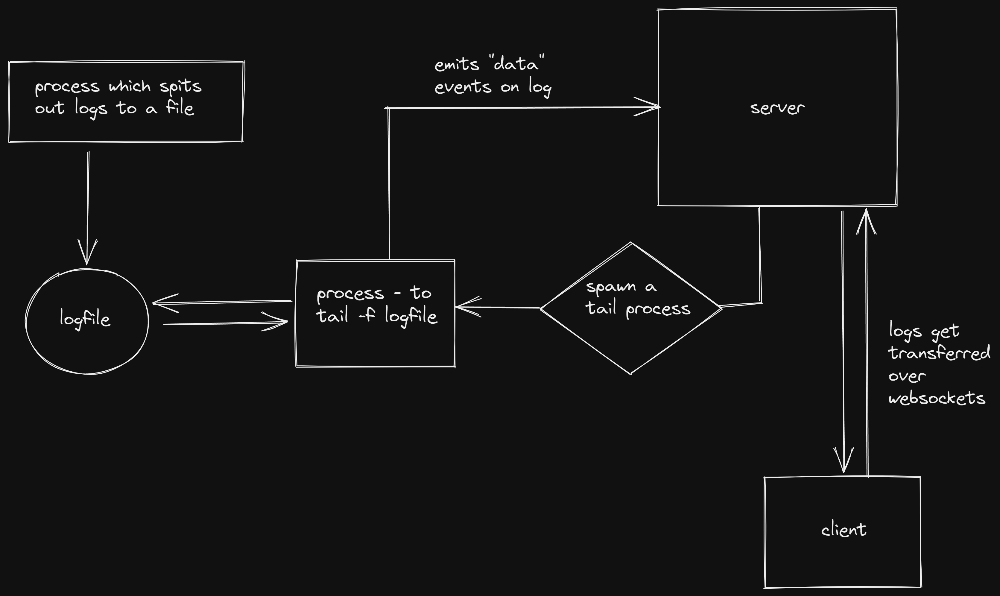

> **Disclaimer**: I am a noob, use the things discussed here at your own risk.

As I watched the logs of the 352nd build of this website pass by, I had a question.

> How are the build logs sent to the browser?


## Basic architecture

The basic architecture, is pretty straightforward. You read a process' logs via, let's say, `tail`, and send it to the client via websockets (which seemed most intuitive to me, of course, other methods probably exist).

Of course, its overly simplistic, hand-waving away a lot of things (errors, process gets killed) but for now, let's keep it simple.



## Implementation

### The log reader

```js
import { spawn } from "child_process";

// create a child process to tail the logs
export function reader(socket, { command, args }) {
  // pass the socket from the function call
  const proc = spawn(command, args);
  // exit
  proc.on("close", (code) => {
    console.log(`child process exited with code ${code}`);
  });
  // output sth
  proc.stdout.on("data", (data) => {
    // converting the buffer to string
    // the data emitted here is actually a Buffer
    const str = data.toString();
    socket.send(
      JSON.stringify({
        event: "log",
        log: str,
      })
    );
  });
}
```

The `reader(...)` function takes the connection socket (for communication), and the UNIX command `tail` as arguments. This spawns a process which gives the last lines of the logfile, and for every subsequent log to `stdout`, emits the "data" event. We handle that event, and send back the new log line to the client via the passed websocket.

Keep in mind this works only for a single client as of now, since we also will need some way of managing mutiple connections, authentication in a real life scenario.

### The WebSocket server

```js
import { WebSocketServer } from "ws";
import { logger } from "./lib/logger.js";
import { reader } from "./lib/tail.js";

const WS_PORT = 8001;

// init websocket server
const wss = new WebSocketServer({ port: WS_PORT }, () => {
  logger(`WSS Server running on port ${WS_PORT}`);
});

const wssHandler = (socket) => {
  logger("New connection");

  socket.on("message", (msg) => {
    const jsonMsg = JSON.parse(msg.toString());
    logger(jsonMsg, "ws");
    // if start
    if (jsonMsg.msg === "start") {
      reader(socket, {
        command: "tail",
        args: ["-f", "scripts/stream-this.log"],
      });
    }
    // start tail on scripts/stream-this.log
  });

  socket.on("close", () => {
    logger(`client disconnected`);
  });
};

wss.on("connection", wssHandler);
```

Here we initialize a new websocket server, and have a handler setup to handle incoming connections. The "message" event checks for a "start" command from the client, and starts reading the log file via the `reader(...)` function discussed above and streaming it back to the client.

### The result

<video src="./result.mp4" controls></video>

With a little client side Javascript, we have our homemade log streamer app functional.

This can be improved and extended in many ways, for example, restarting the build, stopping the build, updating the build command, all these options can be provided client side.

### Closing thoughts

Setting this up was definitely fun. I have uploaded the entire source code to GitHub, if you find any mistakes, or want to improve it, or just want to discuss more things, let me know in the comments of this page or open an issue in the repo.

### [Source Code](https://github.com/sadn1ck/experiment-streaming-logs)
